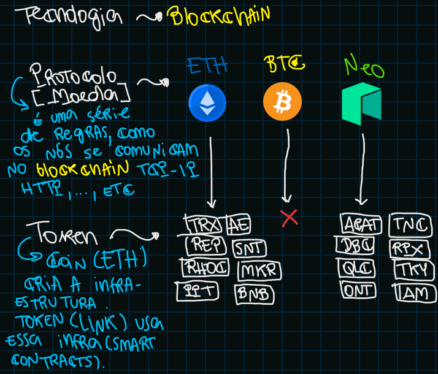
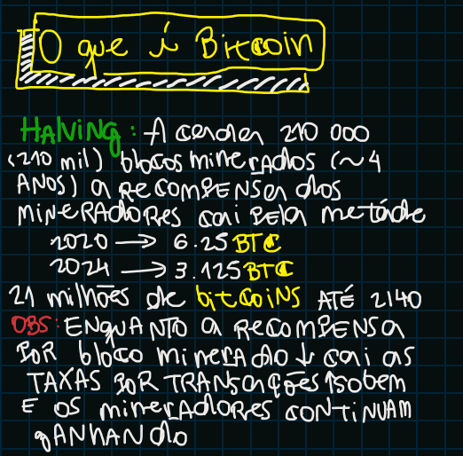
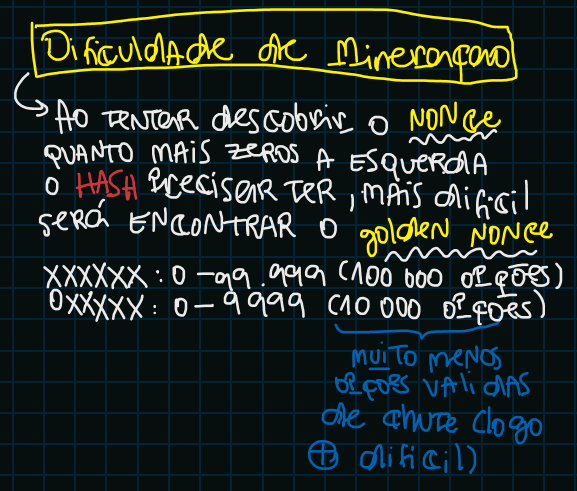
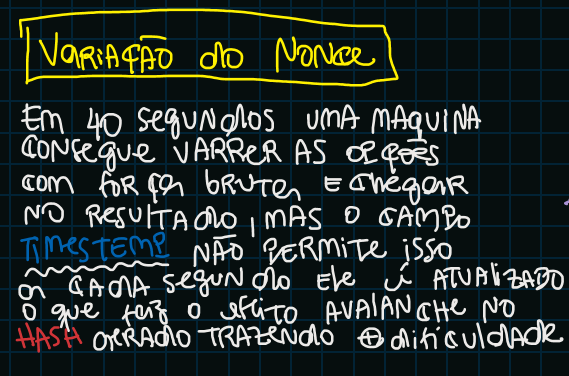
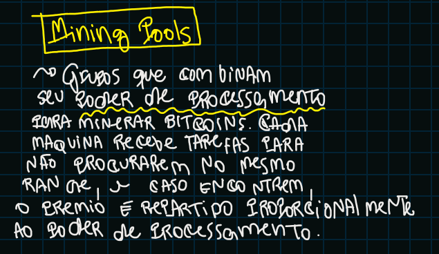
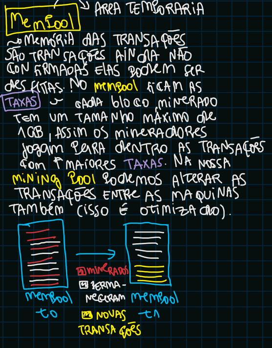

# Blockchain
## O que é o Blockchain?
**Blockchain** é como se fosse uma cadeia de transações no tempo, onde o "lote" de transações posterior tem uma ligação de dependencia com o "lote" de transações anteriores. Ou seja as transações estão conectadas.

## Como ocorre essa conexão?
A conexão entre os "lotes" (blocos) de transações acontece por meio da criação de um *HASH* que respeita uma certa condição e é gerado a partir do bloco anterior (lote de transação anterior).

## Mas pra que serve esse HASH?
O *HASH* ajuda a ter registros **imutáveis**, quando chegamos em um *HASH* válido toda a rede o toma como verdade e segue para o próximo bloco, alterar um bloco seria alterar todos os blocos anteriores, o que seria muito dificil (≈ impossivel)

## Como a rede distribuida funciona?
A rede distribuida valida o *HASH* gerado após validado ele é compartilhado. Para tentar alterar um bloco é preciso alterar a maioria das maquinas 51% o (≈ impossivel). A rede segue um protocolo de consenso ou seja ela entre em acordo entre as diversas maquinas de que um *HASH* é o ganhador e então compartilha essa informação.

## Tolerância a Falhas Bizantinas
Explica como um protocolo de consenso funciona e a sua eficiencia.

## Mineração
A mineração consiste em encontrar o **NONCE** um número [0, ∞[ que gere um *HASH* "vencedor" aquele que resolve o desafio, não é um calulo é algo **aleatório** e por conta disso a dificuldade de mineração.

## Protocolos de consenso
Temos dois tipos de protocolo de consenso:
1. PoW (Proof of Work): Prova de trabalho, prova que houve de fato muita computação para se chegar no **golden nonce** o que resolve o *HASH*
2. PoS (Proof of Stake): Prova de Partição, integrantes com muitos tokens fazem a validação colocando em cheque a reputação da rede através das suas moedas.

Para entender de forma *ilustrativa* como o **blockchain** funciona clique [aqui](https://andersbrownworth.com/blockchain/hash)

## Protocolos [Moeda] / Token
A tecnologia utilizada por todas crypto moedas é o `blockchain`, mas cada uma delas segue o seu próprio protocolo (a maneira com a qual o seu `blockchain` deve funcionar) e sim, esse protocolo é o que vemos em *redes* de computadores **TCP-IP, HTTP, ...**. Algumas moedas ainda possuem `TOKENS` (tokens nada mais são do que **SMART CONTRACTS**) que algumas moedas possuem e permitem fazer algumas coisas dentro da infraestrutura criada pela moeda, como por exemplos NFTs (Tokens não Fungiveis). O Bitcoin não possui `TOKENS` ele faz apenas **transações**.

# Bitcoin

## Dificuldade de Mineração e Variação do Nonce
A dificuldade de mineração se dá ao colocarmos `ZEROS` a esquerda do `HASH` procurado, isso faz com que os numéros possiveis para *golden nonce* diminuam tornando dificeis a parte de mineração.

Mas mesmo assim em poucos segundos sua maquina conseguiria testar todas as combinações possiveis descobrindo o *golden nonce* ai entra outro componente que é adicionado na geração do `HASH` o `TIMESTEMP` ele se atualiza a cada segundo tornando o trabalho ainda mais trabalhoso.

## Mining Pools
Se a sua capacidade de processamento for pequena, pode se reunir com um grupo e trabalharem juntos, é isso que o `MINING POOL` é.

Fazendo parte de um grupo de mineração você os ajuda com o que tiver a encontrar o *golden nonce*.

## Mempool
É como um registro intermediario do que está acontecendo, suas transações que ainda não foram consolidadas em um `BLOCO` ficam no `MEMPOOL` e os mineradores decidem se ela vai entrar ou não no próximo bloco.

